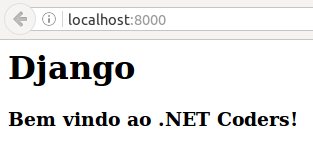

# Mini Curso de Django no .NET Coders

Este foi um [Mini Curso de Django](http://www.meetup.com/NetCoders/events/234404331/) realizado pelo [.NET Coders](http://blog.netcoders.com.br/) em 09 de Outubro de 2016.


## Ementa

* [Git](#git)
* [1 min de Python](#1-min-de-python)
* [O que é Django e pra que serve?](#o-que-é-django-e-pra-que-serve)
* [Entendendo o Padrão MVC](#entendendo-o-padrão-mvc)
* [Ambiente Virtual de Desenvolvimento](#ambiente-virtual-de-desenvolvimento)
* [Instalação](#instalação)
* [Qual será Nosso Projeto?](#qual-será-nosso-projeto)
* [Configurando o Django](#configurando-o-django)
* [A view mais simples do mundo](#a-view-mais-simples-do-mundo)
* [Explorando o Admin](#explorando-o-admin)
* [Introdução aos Templates](##introdução-aos-templates)
* [Entendendo o ORM do Django](#entendendo-o-orm-do-django)
* [CRUD com Functions Based Views](#crud-com-functions-based-views)
* [CRUD com Class Based Views](#crud-com-class-based-views)
* [Templates Tags e Filtros](#templates-tags-e-filtros)
* [Várias formas de se fazer um formulário](##várias-formas-de-se-fazer-um-formulário)
* [Deploy no Heroku](#deploy-no-heroku)


## Objetivo

Criar uma lista de filmes e retornar o filme de maior bilheteria.

* Criar um formulário
* Criar uma lista de filmes
* Ver os detalhes de cada filme


## Git

* Crie uma conta no GitHub
* Gere uma chave ssh na sua máquina
* Configure sua ssh no settings do GitHub

### [Generating a new SSH key](https://help.github.com/articles/generating-a-new-ssh-key-and-adding-it-to-the-ssh-agent/)

```bash
ssh-keygen -t rsa -b 4096 -C "email@example.com"
```

```bash
Generating public/private rsa key pair.
Enter file in which to save the key (/home/vagrant/.ssh/id_rsa): 
Enter passphrase (empty for no passphrase): 
Enter same passphrase again: 
Your identification has been saved in /home/vagrant/.ssh/id_rsa.
Your public key has been saved in /home/vagrant/.ssh/id_rsa.pub.
The key fingerprint is:
28:67:2f:04:39:ff:04:6c:d4:e4:5d:68:04:05:eb:ea email@example.com
The key's randomart image is:
+--[ RSA 4096]----+
|      .o+=o..    |
|     + ..oo.     |
|    + + o..      |
|     = +         |
|    . * S        |
|     = =         |
|      o o        |
|     . .         |
|      E          |
+-----------------+
```

#### Adicionando seu SSH Key no ssh-agent

```bash
eval "$(ssh-agent -s)"
ssh-add ~/.ssh/id_rsa
```

#### Copiando a chave

```bash
cat ~/.ssh/id_rsa.pub
```

#### Configurando o SSH no GitHub

Clique no seu perfil e vá em **Settings**.

Em seguida vá em **SSH and GPG keys**.

Clique no botão **New SSH key** e cole o `id_rsa.pub`.

#### Criando o repositório

Agora crie um novo repositório clicando no icone '+' e em **new repository**.

Vamos chamar o repositório de **djangotutorial**.

Agora clone o projeto digitando

```bash
git clone git@github.com:nome/djangotutorial.git
cd djangotutorial
```

Talvez você precise configurar no seu terminal os seguintes comandos

```
git config --global user.name "Seu Nome"
git config --global user.email "email@example.com"
```

Edite o README.

```bash
git status
git add README.md
git status
git commit -m "First Commit"
git push
```


## 1 min de Python

```python
print("Python")

def soma(a, b):
    return a + b

soma(25,9)

lista = ['a', 10, 5.5]
for i in lista:
    print(i)

for i in range(10):
    print(i)
```


## O que é Django e pra que serve?

Segundo Django Brasil,

*Django é um framework web de alto nível escrito em Python que estimula o desenvolvimento rápido e limpo.*

* adota o padrão MTV
* possui ORM
* admin
* herança de templates e modelos
* open source

## Quem usa Django?


https://www.djangosites.org/


## Entendendo o Padrão MVC

### MVC x MTV

* Model - é o modelo, a camada de abstração do banco de dados, onde acontece o ORM
* View - é o controlador, onde acontece as regras de negócio e a comunicação entre a base de dados e o navegador
* Templates - é a camada de apresentação, são as páginas html


## Ambiente Virtual de Desenvolvimento

O Python 3 já tem um **virtualenv** como bateria inclusa. *virtualenv* é um ambiente onde você isola as dependências do seu projeto.

```bash
python -m venv .venv
```

### Ativando o virtualenv

```bash
source .venv/bin/activate
# .venv/Scripts/activate.bat # Windows
```

**Obs:** todos os pacotes instalados com o ambiente ativado serão instalados dentro do ambiente e visíveis somente nele.

**Dica:** No Linux, edite o arquivo `~/.bashrc`.

```bash
alias sa='source .venv/bin/activate;'
```

Assim você cria atalhos para ativar seus ambientes:

```bash
$ sa
```

**Dica:** Para diminuir o caminho do prompt digite

```bash
$ PS1="(`basename \"$VIRTUAL_ENV\"`):/\W$ "
```

O caminho vai ficar assim

```bash
(.venv):/djangotutorial$
```

Onde `(.venv)` é o nome do ambiente e `:/djangotutorial$` é a pasta atual.

Para desativar o ambiente digitamos

```bash
(.venv):/djangotutorial$ deactivate
```


## Instalação

* Python 3
* Pip
* Virtualenv

**Instalando Python 3 no Windows**

Vá em www.python.org/downloads/ e baixe Python 3.5.2. Ao instalar não esqueça de marcar o check 'Add Python 3.5 to PATH'.

**Instalando Python 3 no Linux ou Mac**

Sugiro este tutorial de instalação com pyenv https://github.com/rg3915/django-experience/wiki/Instalando-o-pyenv


## Qual será Nosso Projeto?

* Ambiente: .venv
* Projeto: myproject
* App: core

### Instalando o Django

```bash
pip install django
```

Vendo o que foi instalado

```bash
pip freeze
Django==1.10.1
```

Crie o `requirements.txt` (os ingredientes do bolo)

```bash
pip freeze > requirements.txt
```

### Criando o projeto e a App

Para criar o **projeto** digite

```bash
django-admin.py startproject myproject .
```

repare no ponto final do comando, isto permite que o arquivo `manage.py` fique na pasta "principal", pasta `.venv`.

Criando a **app**

```bash
cd myproject
python ../manage.py startapp core
cd ..
```

**Dica:** você pode digitar

```bash
manage startapp core
```

mas para funcionar este comando você deve editar o `~/.bashrc`.

```bash
alias manage='python $VIRTUAL_ENV/../manage.py'
```

O que temos até aqui?

    .
    |-- manage.py
    |-- myproject
    |   |-- core
    |   |   |-- admin.py
    |   |   |-- apps.py
    |   |   |-- __init__.py
    |   |   |-- models.py
    |   |   |-- tests.py
    |   |   `-- views.py
    |   |-- __init__.py
    |   |-- settings.py
    |   |-- urls.py
    |   `-- wsgi.py
    


## Django funcionando em nível 0

Declarando o app `core` em `settings.py`

```python
INSTALLED_APPS = [
    # ...
    'myproject.core',
]
```

Criando a primeira migração

```bash
manage migrate
```

Rodando a aplicação

```bash
manage runserver
# ou
# manage runserver 8080
```

[http://localhost:8000/](http://localhost:8000/)


## Configurando o Django

> **Importante:** nunca coloque sua `SECRET_KEY` no git.

Vamos editar o `settings.py`.

Extraia a `SECRET_KEY`, crie um arquivo `.env` na pasta principal e coloque-o lá.

```bash
touch .env
```

O `.env` vai ficar assim:

```python
SECRET_KEY=su4_s3cr3t_k3y_sup3r_s3cr3t4
```

**Note** que eu tirei as aspas simples e o espaço em branco entre o sinal de igual.

E o `settings.py` vai ficar assim:

```python
from decouple import config, Csv

SECRET_KEY = config('SECRET_KEY')
```

Repare que estamos usando o [python-decouple](https://github.com/henriquebastos/python-decouple). Para instala-lo digite

```bash
pip install python-decouple
```

Voltando ao `.env` façamos

```python
SECRET_KEY=su4_s3cr3t_k3y_sup3r_s3cr3t4
DEBUG=True
ALLOWED_HOSTS=127.0.0.1, .localhost
```

E o `settings.py`

```python
SECRET_KEY = config('SECRET_KEY')

DEBUG = config('DEBUG', default=False, cast=bool)

ALLOWED_HOSTS = config('ALLOWED_HOSTS', default=[], cast=Csv())
```

Configurando melhor o banco de dados

```python
from dj_database_url import parse as dburl

default_dburl = 'sqlite:///' + os.path.join(BASE_DIR, 'db.sqlite3')
DATABASES = {
    'default': config('DATABASE_URL', default=default_dburl, cast=dburl),
}
```

**Note** que estamos usando o [dj-database-url](https://github.com/kennethreitz/dj-database-url).

```bash
pip install dj-database-url
```


### .gitignore

Antes de "commitar" nosso código digite `git status`.

Repare que a pasta `.venv` e o `db.sqlite3` serão versionados, mas não deve.

> **Boas práticas:** NÃO versione seu ambiente virtual e nem seu banco de dados.

Vamos editar o `.gitignore`.

```
.venv
*.sqlite3
```

Pronto! Agora você pode dar seu primeito `commit`.

```bash
git add .
git commit -m "First project"
git push
```

## A view mais simples do mundo

    .
    |-- 
    |-- myproject
    |   |-- core
    |   |   |-- ...
    |   |   `-- views.py
    |   |-- settings.py
    |   |-- urls.py

### Editando views.py

```python
# from django.shortcuts import render
from django.http import HttpResponse


def home(request):
    return HttpResponse('<h1>Django</h1><h3>Bem-vindo ao .NET Coders!</h3>')
```

### Editando urls.py

```python
from django.conf.urls import url
from django.contrib import admin
from myproject.core.views import home

urlpatterns = [
    url(r'^$', home),
    url(r'^admin/', admin.site.urls),
]
```




## Explorando o Admin

```bash
manage createsuperuser --username='admin' --email=''
```


## Introdução aos Templates

### Editando o settings.py

```python
LANGUAGE_CODE = 'pt-br'

TIME_ZONE = 'America/Sao_Paulo'

LOGIN_URL = '/admin/login'
```

## Testes


### Teste: Verificar se existe a página *index.html*.

```python
from django.test import TestCase


class HomeTest(TestCase):

    def setUp(self):
        self.resp = self.client.get('/')

    def test_get(self):
        ''' get / deve retornar status code 200. '''
        self.assertEqual(200, self.resp.status_code)

    def test_template(self):
        ''' Home deve usar template index.html '''
        self.assertTemplateUsed(self.resp, 'index.html')
```

**Leia**: "pytest: escreva menos, teste mais" - Erick Wilder de Oliveira - https://goo.gl/8E9FB1


### Editando views.py

```python
from django.shortcuts import render
# from django.http import HttpResponse

# def home(request):
#     return HttpResponse('<h1>Django</h1><h3>Bem-vindo ao .NET Coders!</h3>')

def home(request):
    return render(request, 'index.html')
```

### Criando o index.html

Estando na pasta `venv` digite

```bash
mkdir -p core/templates
echo "<html><body><h1>Tutorial Django</h1><h3>Bem-vindo ao .NET Coders.</h3></body></html>" > core/templates/index.html
```

Explorando o [layoutit](http://www.layoutit.com/)


## Editando models.py

**Básico**: Filmes


```python
from django.db import models


class Distributor(models.Model):
    distributor = models.CharField('distribuidor', max_length=50, unique=True)

    class Meta:
        ordering = ['distributor']
        verbose_name = 'distribuidor'
        verbose_name_plural = 'distribuidores'

    def __str__(self):
        return self.distributor


class Category(models.Model):
    category = models.CharField('categoria', max_length=50, unique=True)

    class Meta:
        ordering = ['category']
        verbose_name = 'categoria'
        verbose_name_plural = 'categorias'

    def __str__(self):
        return self.category


class Movie(models.Model):
    movie = models.CharField('filme', max_length=100)
    category = models.ForeignKey(
        'Category', verbose_name='categoria', related_name='movie_category')
    distributor = models.ForeignKey(
        'Distributor', verbose_name='distribuidor', related_name='movie_distributor')
    raised = models.DecimalField('arrecadou', max_digits=4, decimal_places=3)
    liked = models.BooleanField('gostou', default=True)
    release = models.DateTimeField(u'lançamento')

    class Meta:
        ordering = ['-release']
        verbose_name = 'filme'
        verbose_name_plural = 'filmes'

    def __str__(self):
        return self.movie
```


### Tipos de campos

https://docs.djangoproject.com/en/1.10/ref/models/fields/


### Atualizando o banco

```bash
python manage.py makemigrations
python manage.py migrate
```


## Entendendo o ORM do Django

Explorando um pouco as queryset.

```bash
$ python manage.py shell
Python 3.5.0 (default, Dec  8 2015, 01:17:16) 
[GCC 4.8.4] on linux
Type "help", "copyright", "credits" or "license" for more information.
(InteractiveConsole)
>>>
```

Precisamos importar o models.

```python
>>> from myproject.core.models import Distributor, Category, Movie
>>> import datetime
>>> Distributor.objects.create(distributor='Disney')
>>> Category.objects.create(category='ação')
>>> category = Category.objects.get(category='ação')
distributor = Distributor.objects.get(distributor__icontains='disney')
Movie.objects.create(
    movie='Os Vingadores',
    category=category,
    distributor=distributor,
    raised=1.519,
    release=datetime.date(2012, 4, 27)
)
```


https://docs.djangoproject.com/en/1.10/ref/models/querysets/

https://pt.wikipedia.org/wiki/Lista_de_filmes_de_maior_bilheteria


### Admin novamente

```python
from django.contrib import admin
from .models import Distributor, Category, Movie


admin.site.register(Distributor)
admin.site.register(Category)
admin.site.register(Movie)
```


### Turbinando o shell com iPython e django extensions

```bash
pip install django-extensions
```

Em `settings.py`

```python
INSTALLED_APPS = [
    # ...
    # thirty apps
    'django_extensions',
    # ...
]
```

Agora podemos digitar

```bash
manage shell_plus
```


### Explorando mais o shell do Django

Façamos

```bash
mkdir shell
touch shell/{categorys.py,distributors.py,movies.py}
```

Veja o código de cada arquivo em [shell/](shell/).

Para rodar o script façamos

```bash
manage shell < shell/categorys.py
manage shell < shell/distributors.py
manage shell < shell/movies.py
```

Leia mais

```python
from core.models import Distributor, Category, Movie
import datetime
obj = Distributor(distributor='Paramount Pictures')
obj.save()

Distributor.objects.create(distributor='Universal Pictures')
Distributor.objects.create(distributor='Walt Disney Pictures')

CATEGORY_LIST = ['ação', 'animação', 'aventura', 'comedia', 'guerra', 'suspense']
obj = [Category(category=val) for val in CATEGORY_LIST]
Category.objects.bulk_create(obj)

category = Category.objects.get(category='ação')
distributor = Distributor.objects.get(distributor__istartswith='Warner')
Movie.objects.create(
    movie='O Exterminador do Futuro',
    category=category,
    distributor=distributor,
    raised=1.756,
    release=datetime.date(1984, 10, 26)
)

category = Category.objects.get(category='aventura')
distributor = Distributor.objects.get(distributor='Lionsgate')
Movie.objects.create(
    movie='Jogos Vorazes',
    category=category,
    distributor=distributor,
    raised=2.308,
    release=datetime.date(2012, 3, 23)
)

q = Movie.objects.all()
q.count()
q
q.values()  # dicionario
q.values_list()  # lista

for i in q.values():
    print(i)

for i in q:
    i.movie, i.category, i.raised

dir(q)

Movie.objects.filter(category='ação')  # retorna erro
Movie.objects.filter(category__category='ação')
Movie.objects.filter(distributor__distributor__icontains='gate')


Movie.objects.filter(movie__icontains='Exterminador').update(
    movie='O Exterminador do Futuro: Gênesis', release=datetime.date(2015, 7, 1))


Movie.objects.filter(id=1).delete()
# Customer.objects.all().delete() # perigoso
t = Movie.objects.get(movie='Titanic')
t
t.id
Movie.objects.filter(id=t.id).delete()
Movie.objects.filter(movie='Titanic')
Movie.objects.filter(movie='Titanic').count()

Movie.objects.filter(release__year=2012).count()
# Movie.objects.filter(release__year__gte=2000).count()  # filmes > 2000

# Filme de maior bilheteria
from django.db.models import Max
q = Movie.objects.all().aggregate(Max('raised'))
q
Movie.objects.filter(raised=q['raised__max'])
```


## CRUD com Functions Based Views


## CRUD com Class Based Views


## Templates Tags e Filtros


## Várias formas de se fazer um formulário


## Deploy no Heroku


## Livros


[Django Essencial de Julia Elman da Novatec](http://www.novatec.com.br/livros/django/)

[Two Scoops of Django 1.8 de Daniel and Audrey Roy Greenfeld](https://www.twoscoopspress.com/) (@pydanny and @audreyr)

[The Django Book](http://djangobook.com/)


## Cursos

[Welcome to the Django](http://welcometothedjango.com.br/) by @henriquebastos

[Construa um E-Commerce com Python 3 e Django](http://bit.ly/2duS45N) by @GilenoFilho

[Python para Zumbis](https://goo.gl/swsHmw)

[CodingEntrepreneurs Try Django 1.9](http://youtu.be/yfgsklK_yFo)


## Final

```python
# Filme de maior bilheteria
from django.db.models import Max
q = Movie.objects.all().aggregate(Max('raised'))
q
m = Movie.objects.filter(raised=q['raised__max'])
m.values()
m[0].movie, m[0].raised
```

Participem do [Grupy-SP](www.meetup.com/pt-BR/Grupy-SP/)

Meu portfólio http://rg3915.github.io/
