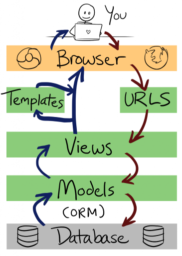

# Mini Curso de Django no .NET Coders

Este foi um [Mini Curso de Django](http://www.meetup.com/NetCoders/events/234404331/) realizado pelo [.NET Coders](http://blog.netcoders.com.br/) em 09 de Outubro de 2016.


## Ementa

* [Git](#git)
* [1 min de Python](#)
* [O que é Django e pra que serve?]
* [Entendendo o Padrão MVC](#entendendo o padrão mvc)
* [Ambiente Virtual de Desenvolvimento](#ambiente virtual de desenvolvimento)
* [Instalação](#instalação)
* [Qual será Nosso Projeto?](#qual será nosso projeto?)
* [Configurando o Django](#configurando o django)
* [Explorando o Admin](#explorando o admin)
* [Introdução aos Templates](#introdução aos templates)
* [Entendendo o ORM do Django](#entendendo o orm do django)
* [CRUD com Functions Based Views](#crud com functions based views)
* [CRUD com Class Based Views](#crud com class based views)
* [Templates Tags e Filtros](#templates tags e filtros)
* [Várias formas de se fazer um formulário](#várias formas de se fazer um formulário)
* [Deploy no Heroku](#deploy no heroku)


## Objetivo

Criar uma lista de filmes e retornar o filme de maior bilheteria.

* Criar um formulário
* Criar uma lista de filmes
* Ver os detalhes de cada filme


## Git

* Crie uma conta no GitHub
* Gere uma chave ssh na sua máquina
* Configure sua ssh no settings do GitHub

### [Generating a new SSH key](https://help.github.com/articles/generating-a-new-ssh-key-and-adding-it-to-the-ssh-agent/)

```bash
ssh-keygen -t rsa -b 4096 -C "email@example.com"
```

```bash
Generating public/private rsa key pair.
Enter file in which to save the key (/home/vagrant/.ssh/id_rsa): 
Enter passphrase (empty for no passphrase): 
Enter same passphrase again: 
Your identification has been saved in /home/vagrant/.ssh/id_rsa.
Your public key has been saved in /home/vagrant/.ssh/id_rsa.pub.
The key fingerprint is:
28:67:2f:04:39:ff:04:6c:d4:e4:5d:68:04:05:eb:ea email@example.com
The key's randomart image is:
+--[ RSA 4096]----+
|      .o+=o..    |
|     + ..oo.     |
|    + + o..      |
|     = +         |
|    . * S        |
|     = =         |
|      o o        |
|     . .         |
|      E          |
+-----------------+
```

#### Adicionando seu SSH Key no ssh-agent

```bash
eval "$(ssh-agent -s)"
ssh-add ~/.ssh/id_rsa
```

#### Copiando a chave

```bash
cat ~/.ssh/id_rsa.pub
```

#### Configurando o SSH no GitHub

Clique no seu perfil e vá em **Settings**.

Em seguida vá em **SSH and GPG keys**.

Clique no botão **New SSH key** e cole o `id_rsa.pub`.

#### Criando o repositório

Agora crie um novo repositório clicando no icone '+' e em **new repository**.

Vamos chamar o repositório de **djangotutorial**.

Agora clone o projeto digitando

```bash
git clone git@github.com:rg3915/djangotutorial.git
cd djangotutorial
```

Talvez você precise configurar no seu terminal os seguintes comandos

```
git config --global user.name "Seu Nome"
git config --global user.email "email@example.com"
```

Edite o README.

```bash
git status
git add README.md
git status
git commit -m "First Commit"
git push
```


## 1 min de Python

```python
print("Python")

def soma(a, b):
    return a + b

soma(25,9)

lista = ['a', 10, 5.5]
for i in lista:
    print(i)

for i in range(10):
    print(i)
```


## O que é Django e pra que serve?

Segundo Django Brasil,

*Django é um framework web de alto nível escrito em Python que estimula o desenvolvimento rápido e limpo.*

* adota o padrão MTV
* possui ORM
* admin
* herança de templates e modelos
* open source

## Quem usa Django?


https://www.djangosites.org/


## Entendendo o Padrão MVC

### MVC x MTV

* Model - é o modelo, a camada de abstração do banco de dados, onde acontece o ORM
* View - é o controlador, onde acontece as regras de negócio e a comunicação entre a base de dados e o navegador
* Templates - é a camada de apresentação, são as páginas html





## Ambiente Virtual de Desenvolvimento

O Python 3 já tem um **virtualenv** como bateria inclusa. *virtualenv* é um ambiente onde você isola as dependências do seu projeto.

```bash
python -m venv .venv
```

### Ativando o virtualenv

```bash
source .venv/bin/activate
# .venv/Scripts/activate.bat # Windows
```

**Obs:** todos os pacotes instalados com o ambiente ativado serão instalados dentro do ambiente e visíveis somente nele.

**Dica:** No Linux, edite o arquivo `~/.bashrc`.

```bash
alias sa='source .venv/bin/activate;'
```

Assim você cria atalhos para ativar seus ambientes:

```bash
$ sa
```

**Dica:** Para diminuir o caminho do prompt digite

```bash
$ PS1="(`basename \"$VIRTUAL_ENV\"`):/\W$ "
```

O caminho vai ficar assim

```bash
(.venv):/djangotutorial$
```

Onde `(.venv)` é o nome do ambiente e `:/djangotutorial$` é a pasta atual.

Para desativar o ambiente digitamos

```bash
(.venv):/djangotutorial$ deactivate
```


## Instalação

* Python 3
* Pip
* Virtualenv

**Instalando Python 3 no Windows**

Vá em www.python.org/downloads/ e baixe Python 3.5.2. Ao instalar não esqueça de marcar o check 'Add Python 3.5 to PATH'.

**Instalando Python 3 no Linux ou Mac**

Sugiro este tutorial de instalação com pyenv https://github.com/rg3915/django-experience/wiki/Instalando-o-pyenv


## Qual será Nosso Projeto?

* Ambiente: .venv
* Projeto: myproject
* App: core

### Instalando o Django

```bash
pip install django
```

Vendo o que foi instalado

```bash
pip freeze
Django==1.10.1
```

Crie o `requirements.txt` (os ingredientes do bolo)

```bash
pip freeze > requirements.txt
```

### Criando o projeto e a App

Para criar o **projeto** digite

```bash
django-admin.py startproject myproject .
```

repare no ponto final do comando, isto permite que o arquivo `manage.py` fique na pasta "principal", pasta `.venv`.

Criando a **app**

```bash
cd myproject
python ../manage.py startapp core
cd ..
```

**Dica:** você pode digitar

```bash
manage startapp core
```

mas para funcionar este comando você deve editar o `~/.bashrc`.

```bash
alias manage='python $VIRTUAL_ENV/../manage.py'
```

O que temos até aqui?

    .
    |-- manage.py
    |-- myproject
    |   |-- core
    |   |   |-- admin.py
    |   |   |-- apps.py
    |   |   |-- __init__.py
    |   |   |-- models.py
    |   |   |-- tests.py
    |   |   `-- views.py
    |   |-- __init__.py
    |   |-- settings.py
    |   |-- urls.py
    |   `-- wsgi.py
    

## Django funcionando em nível 0

Criando a primeira migração

```bash
manage migrate
```

Rodando a aplicação

```bash
manage runserver
```


## Configurando o Django

Editar o `settings.py`

## Explorando o Admin


## Introdução aos Templates


## Entendendo o ORM do Django


## CRUD com Functions Based Views


## CRUD com Class Based Views


## Templates Tags e Filtros


## Várias formas de se fazer um formulário


## Deploy no Heroku


